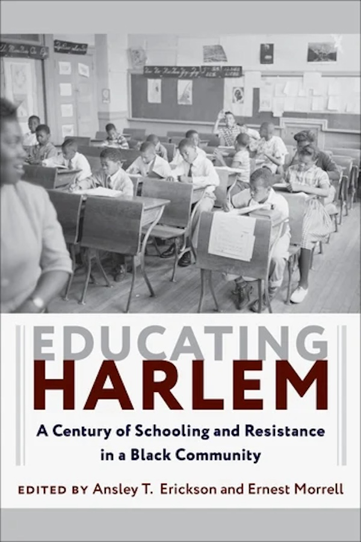

---
#
# By default, content added below the "---" mark will appear in the home page
# between the top bar and the list of recent posts.
# To change the home page layout, edit the _layouts/home.html file.
# See: https://jekyllrb.com/docs/themes/#overriding-theme-defaults
#
layout: home
---

The Harlem Education History Project is a collaborative effort to document and share the history of learning and schooling in Harlem. This site is in development. 

## Featured Schools

Our work has developed through a focus on distinct schools in Harlem, each with their own stories to tell.

### [Wadleigh High School, Junior High School, and Secondary School](www.wadleighhistory.org)

In the history of one building on 114th Street, each of Harlem's many generations of schooling become visible.

 

### [The Modern School](https://modernschoolharlem.org)

An independent Black school in Harlem, from the 1930s to the 1990s. 

 

## [Our Book](www.book.harlemeducationhistory.org)

Our 2019 book,[_Educating Harlem: A Century of Schooling and Resistance in a Black Community_ (Columbia University Press, 2019)](https://cup.columbia.edu/book/educating-harlem/9780231182218) documents Harlem schools - and local teachers and parents' efforts to make them what students deserved - across a hundred years. Explore [a free digital edition of the book](www.book.harlemeducationhistory.org), with additional teaching and learning resources.

